# free-claude


Patches Claude Code to enable nested sub-agent calls - allowing sub-agents to invoke other sub-agents via the Task tool, creating deeper automation chains.

**Note:** Automatically tested and released for latest Claude Code versions.

## What It Does

This tool removes the depth limitation that prevents sub-agents from using the Task tool, enabling recursive agent chains. Sub-agents can now invoke other sub-agents, creating deeper automation workflows.

## Quick Start

### Option 1: Complete npm Package (Recommended)

```bash
# Install the complete patched package directly from GitHub releases
npm install -g https://github.com/yourusername/free-claude/releases/latest/download/free-claude-code-*.tgz

# Verify installation
claude --version
```

Alternative download method:
```bash
# Download and install manually
wget $(curl -s https://api.github.com/repos/yourusername/free-claude/releases/latest | grep "browser_download_url.*free-claude-code.*\.tgz" | cut -d '"' -f 4)
npm install -g free-claude-code-*.tgz
```

### Option 2: Manual Patching

```bash
# Apply patches to Claude Code
make patch

# Or specify Claude binary path
make patch CLAUDE=/path/to/claude

# Run the patched version
free_claude

# Restore original Claude Code from backup
make restore
```

## How It Works

### Complete Package Approach
The auto-release system:
1. **Downloads** the complete `@anthropic-ai/claude-code` npm package
2. **Extracts** all files (binary, vendor files, SDK, etc.)
3. **Applies patches** to the `cli.js` file for sub-agent recursion
4. **Repackages** as `free-claude-code` with modified `package.json`
5. **Releases** complete npm package ready for installation

### Manual Patching (Alternative)
The manual patcher:
1. Locates your Claude Code installation (supports wrapper scripts)
2. Finds the actual JavaScript bundle (`cli.js`)
3. Creates a timestamped backup before patching
4. Applies the patch to enable recursive sub-agents
5. Creates a `free_claude` command in `~/.local/bin`

### Rollback Options
```bash
# From complete package installation
npm uninstall -g free-claude-code
npm install -g @anthropic-ai/claude-code@latest

# From manual patching
make restore
```

## Automatic Releases

This repository automatically creates new releases whenever Claude Code is updated:

- **🤖 Dependabot** monitors for new Claude Code versions daily
- **🧪 Auto-testing** verifies patches work with the new version  
- **📦 Auto-release** creates complete npm package if tests pass
- **⚠️ Alerts** notify if patches need manual updates

Each release includes:
- **Complete npm package** (77MB) - Drop-in replacement for `@anthropic-ai/claude-code`
- **All vendor files** - ripgrep binaries, JetBrains plugin, SDK, etc.
- **Sub-agent recursion enabled** - The critical patch for nested Task tool usage
- **Easy installation** - Single npm command installation
- **Simple rollback** - Uninstall and reinstall original package

### Getting Updates

1. **Watch this repository** for release notifications
2. **Check [Releases](../../releases)** for the latest patched version
3. **Install the complete package** that matches your Claude Code version:
   ```bash
   npm install -g https://github.com/yourusername/free-claude/releases/download/vX.Y.Z/free-claude-code-X.Y.Z.tgz
   ```

### Package Details

- **Package name**: `free-claude-code` (instead of `@anthropic-ai/claude-code`)
- **Size**: ~35MB compressed, ~77MB unpacked  
- **Files**: 53 files including all platform binaries
- **Installation**: Standard npm global install
- **Compatibility**: 100% compatible with original Claude Code

### Release Process

```mermaid
graph LR
    A[Dependabot detects<br/>Claude update] --> B[Auto-test patches]
    B --> C{Tests pass?}
    C -->|✅ Yes| D[Create release<br/>with patched binary]
    C -->|❌ No| E[Label PR<br/>'patches-broken']
    D --> F[Close Dependabot PR]
    E --> G[Manual patch update<br/>required]
```

