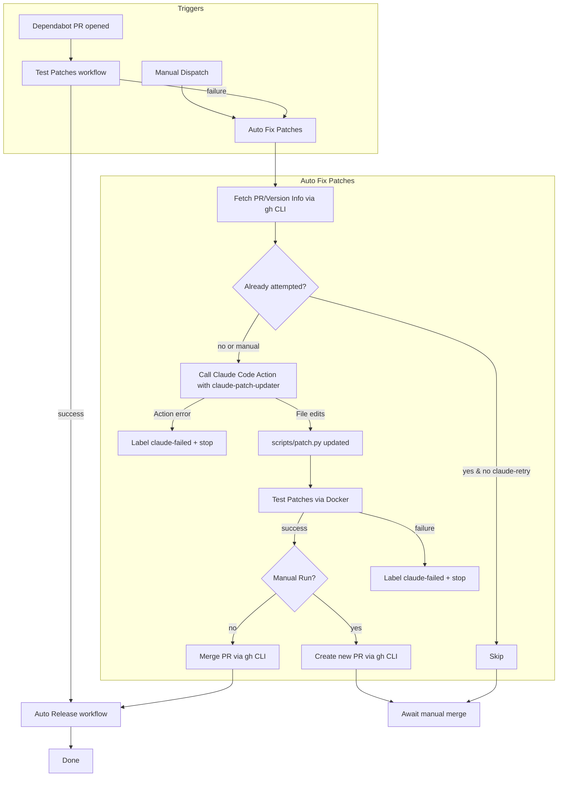

# ADR-0001: Auto-fix failed Dependabot patch PRs using Claude in GitHub Actions

### Status
- Implemented

### Date
- 2025-08-27

### Context
- This repository patches `@anthropic-ai/claude-code` to re-enable recursive sub-agents via `scripts/patch.py` and validates via `Dockerfile` and the "Test Patches" workflow.
- When Dependabot opens a PR for a new `@anthropic-ai/claude-code` version, our current flow runs tests and, on success, triggers `.github/workflows/auto-release.yml` to package and release.
- When patterns change in new upstream versions, patching can fail (regex misses or structure changes). Today this leaves the PR unmerged and requires manual patch updates.

### Decision
- Add a new GitHub Actions workflow that automatically attempts to fix failed Dependabot PRs by invoking the official `anthropics/claude-code-action` to update `scripts/patch.py` patterns for the new upstream version, re-validates the changes, and, if successful, merges and releases.
- All GitHub API interactions are performed using the `gh` CLI for improved readability and maintainability.
- The workflow supports both automatic triggers (from failed Dependabot PRs) and manual triggers via `workflow_dispatch` for proactive patch updates.

### Goals
- Reduce mean-time-to-repair when upstream versions change and break our patches.
- Keep changes contained within the same Dependabot PR branch for auditability.
- Preserve safety via structured edits, validation, and idempotent release steps.

### Non-goals
- Building a general-purpose code refactoring bot beyond updating our patch patterns.
- Changing the fundamentals of `scripts/patch.py` beyond what is needed per version.

### Architecture Overview
- Components:
  - `test-patches.yml` (existing): Builds and verifies patches using `Dockerfile`.
  - `auto-release.yml` (updated): Packages and releases when patches pass. Now handles PRs merged by the auto-fix action.
  - `auto-fix-patches.yml` (new): Runs when test patches fail on Dependabot PRs or is manually triggered. It:
    - Collects PR and version metadata using the `gh` CLI
    - Invokes `anthropics/claude-code-action` with a prompt to use the `claude-patch-updater` agent
    - The action directly modifies `scripts/patch.py`
    - Commits changes to the PR branch (or a new branch for manual runs)
    - Re-runs validation with a local Docker build
    - If passing, merges the PR (or creates a new one) and triggers the release workflow
- **No custom agent runner scripts are needed.** The official Claude Code Action handles all interaction with the Anthropic API.

### Triggers and Flow
```
Dependabot PR opened
   │
   ├─▶ Test Patches ── success ──▶ Auto Release (existing) ──▶ Done
   │
   └─▶ Test Patches ── failure ──▶ Auto Fix Patches (new)
                                  │
                                  ├─ Call Claude Code Action (claude-patch-updater)
                                  ├─ Update scripts/patch.py (performed by action)
                                  ├─ Test updated patches locally
                                  ├─ Commit to the PR branch
                                  │
                                  ├─ success ──▶ Merge PR ──▶ Release ──▶ Done
                                  │
                                  └─ failure ──▶ Label "claude-failed" + notify
```

### Sequence (concise)
```
Auto Fix ──get PR/version──▶ gh CLI
Auto Fix ──prompt──────────▶ Claude Code Action
Action ───edits file──────▶ scripts/patch.py
Auto Fix ──test────────────▶ Docker
Auto Fix ──commit+merge────▶ gh CLI
CI ───────release─────────▶ Auto Release workflow
```

### Key Design Details
- Invocation:
  - Use the official `anthropics/claude-code-action@v1`.
  - The prompt instructs the action to use the existing `.claude/agents/claude-patch-updater.md` agent.
  - The action's built-in intelligence handles context gathering (reading `scripts/patch.py`, etc.) without needing manual pattern extraction or log uploading.
  - Output contract: The action directly modifies files in the workspace. No JSON parsing is required.

- Validation:
  - After the action runs, the workflow runs the same Docker-based tests used by `test-patches.yml` to ensure parity.

- PR Update & Merge:
  - All operations (commenting, labeling, merging, creating PRs) are handled by the `gh` CLI.
  - For automatic runs, changes are pushed to the Dependabot PR branch and merged on success.
  - For manual runs, a new branch and PR are created.

- Release Integration:
  - The condition in `auto-release.yml` is relaxed to allow `github-actions[bot]` as the actor when the PR was authored by `dependabot[bot]`, enabling the release to trigger after an auto-merge.

### Permissions & Secrets
- Workflow permissions: `contents: write`, `pull-requests: write`, `issues: write`, `actions: write`.
- Secrets:
  - `ANTHROPIC_API_KEY` (required): For authenticating with the Anthropic API.
  - `ANTHROPIC_BASE_URL` (optional): For enterprise or regional endpoints.
  - `ANTHROPIC_AUTH_TOKEN` (optional): Alternative to the API key.
  - `GITHUB_TOKEN` is provided by Actions.

### Consequences
- Positive:
  - Faster recovery from upstream changes, fewer manual interventions.
  - Reuses existing agent prompt and Docker validation for consistency.
  - **Simplified solution**: No custom scripts to maintain, leveraging an official, well-supported action.
- Risks/Mitigations:
  - Incorrect edits: Mitigated with full re-validation via Docker test build.
  - Release coupling: Addressed by relaxing conditions in the release workflow.

### Implementation Plan (high-level)
- Add `.github/workflows/auto-fix-patches.yml` to run on `workflow_run` failure of "Test Patches" and on `workflow_dispatch`.
- **No agent runner script needed.**
- Update `auto-release.yml` conditions to allow triggering from auto-merged PRs.
- Use `gh` CLI for all GitHub API interactions.

### Open Questions
- Which language for the runner (Node vs Python) given the repo toolchain? **Answered: Neither. Using the official pre-built action.**
- Preferred merge strategy (squash vs merge) for Dependabot PRs after auto-fix? **Answered: Squash.**

### References
- `.claude/agents/claude-patch-updater.md`
- `.github/workflows/auto-release.yml`
- `scripts/patch.py`
- `Dockerfile`

### Comprehensive Flow (Mermaid)


